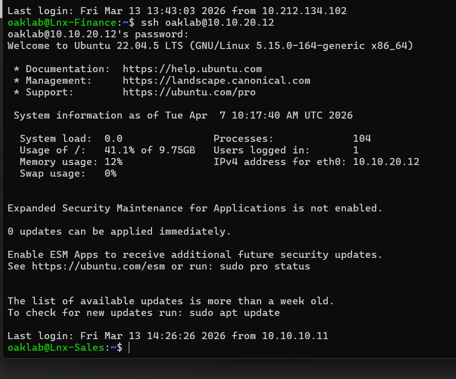
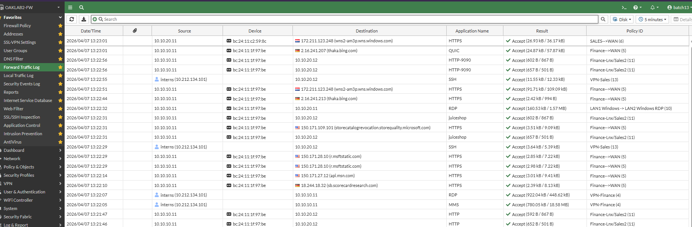
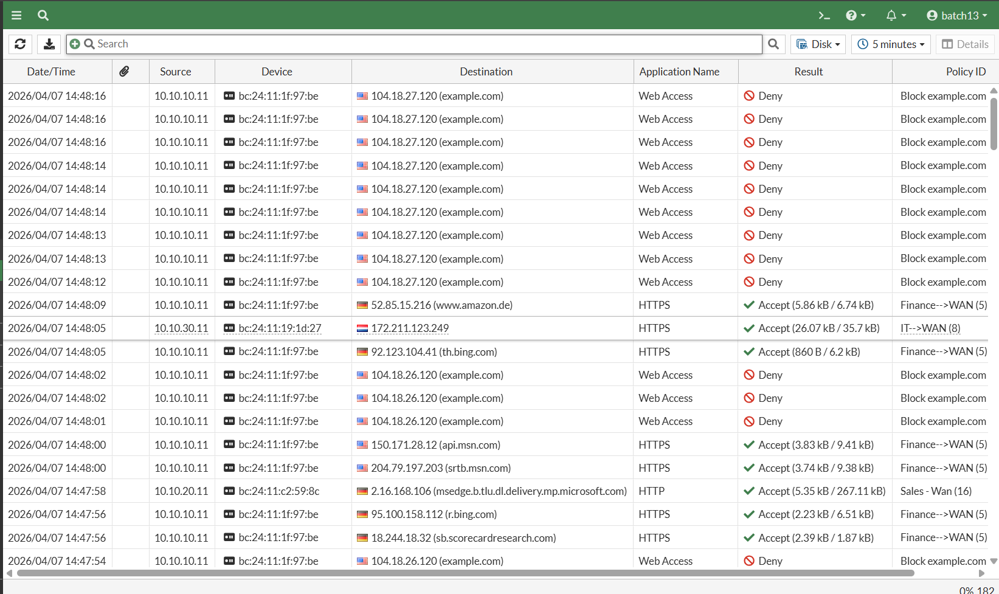
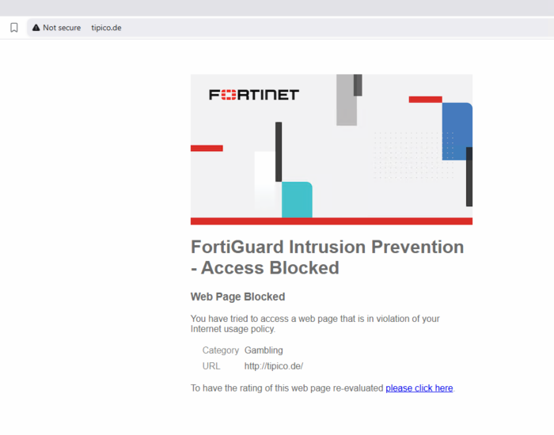
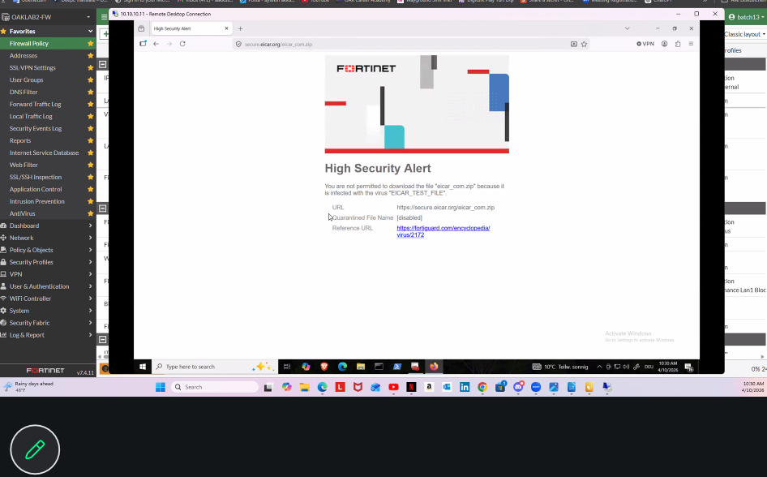
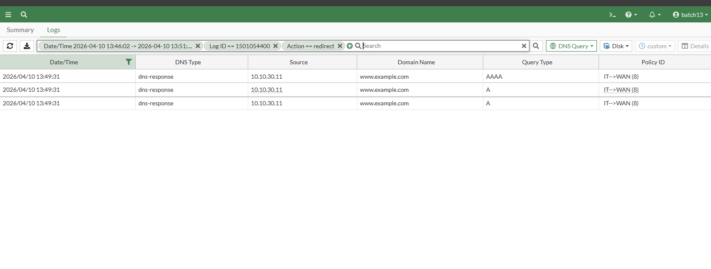

# FortiGate Firewall — Network Segmentation & Security Policy Implementation

**Team project (OAK Academy)** — configured and tested a segmented enterprise-style network in a FortiGate lab, implementing least-privilege firewall policies, VPN access, and layered security controls (AV, IPS, Web/DNS/Application Filtering).

`Firewall Configuration` `FortiGate` `Network Segmentation` `VPN (FortiClient)` `Least Privilege` `Virtual IP / Port Forwarding` `Web Filtering` `DNS Filtering` `IPS` `Antivirus` `Application Control` `Log Analysis`

---

## Network Topology

| Segment | Subnet | Purpose |
|---|---|---|
| LAN1 | `10.10.10.0/24` | Finance |
| LAN2 | `10.10.20.0/24` | Sales |
| IT Network | `10.10.30.0/24` | IT |
| DMZ | `172.30.89.0/24` | Public-facing services |

All traffic between segments routed and controlled through the firewall — no direct inter-segment access outside defined policy.

## What I Did

| Area | Action | Result |
|---|---|---|
| **Access & VPN** | Connected to the firewall via FortiClient VPN; reviewed and validated the existing configuration | Confirmed baseline before building new policies |
| **Least-Privilege OS Access** | Restricted Linux-to-Linux traffic (LAN1→LAN2) to **SSH + ICMP only**; restricted Windows-to-Windows traffic to **RDP only** | Verified that the configured policies allowed only the specified protocols during the lab tests |
| **Internal Web Server** | Deployed a web server (Python `http.server`) on a LAN2 Linux host across ports `80`, `8080`, `9090`; created a policy allowing LAN1 access to those ports only | Access confirmed via both firewall logs and server-side logs |
| **Virtual IP & Port Forwarding** | Configured a Virtual IP with port forwarding to expose the LAN2 web server | Verified reachable through the VIP as designed |
| **Internet Access Control** | Gave LAN2 unrestricted internet access; restricted LAN1 to block specific targets (`example.com`, `1.1.1.1`) while allowing everything else | Blocking confirmed via logs |
| **Cloud Egress Control** | Blocked LAN2 access to AWS services while keeping general internet access open | Verified blocked in logs |
| **Application Control** | Built app-based policies for LAN2 Windows devices blocking Instagram, Facebook, and Gmail | Blocks confirmed live and in logs |
| **Web Filtering** | Enabled Web Filtering for LAN1 with a custom category-based policy (social networks, high-risk sites) | Confirmed categories blocked as configured |
| **Antivirus** | Enabled AV scanning; tested with the EICAR test file from eicar.org | Download blocked — AV module confirmed working |
| **IPS** | Enabled Intrusion Prevention between internal subnets | Simulated malicious traffic successfully blocked and logged |
| **DNS Filtering & Redirect** | Configured DNS Filter to redirect `example.com` requests to a DMZ-hosted web server; stood up a DNS server in the DMZ resolving to the LAN2 web server | Tested DNS resolution and redirect behavior in the lab environment |
| **Logging** | Applied log filtering to every rule created | Reviewed filtered logs for the configured policies to support troubleshooting and verification |

## Key Takeaways

- Applying least-privilege policy design required identifying and explicitly defining the necessary network connections, while avoiding `any-any` rules.
- Network segmentation across LAN1, LAN2, IT, and DMZ helped restrict communication to the paths defined by firewall policies.
- Virtual IP, port forwarding, and DNS redirection provided different ways to control access to services in the lab environment.
- Layered security controls (AV, IPS, Web/DNS/Application Filtering) addressed different types of traffic and security risks.
- Firewall policies needed to reflect the different access requirements of each network segment.
- Reviewing firewall and server logs helped validate policy behavior and troubleshoot connectivity.

## Evidence (Screenshots)

A small, representative set of screenshots is included below — enough to show each control actually working, without publishing the full internal policy table or log set.

### Least-Privilege OS Access

### Internet & Web Access Control

### Antivirus

### DNS Filtering

---

*Project completed as part of OAK Academy's Cybersecurity Engineering program in a controlled training lab environment. Original report written in German; this is an English portfolio summary.*
